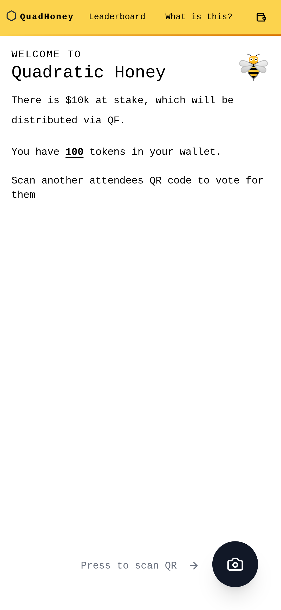
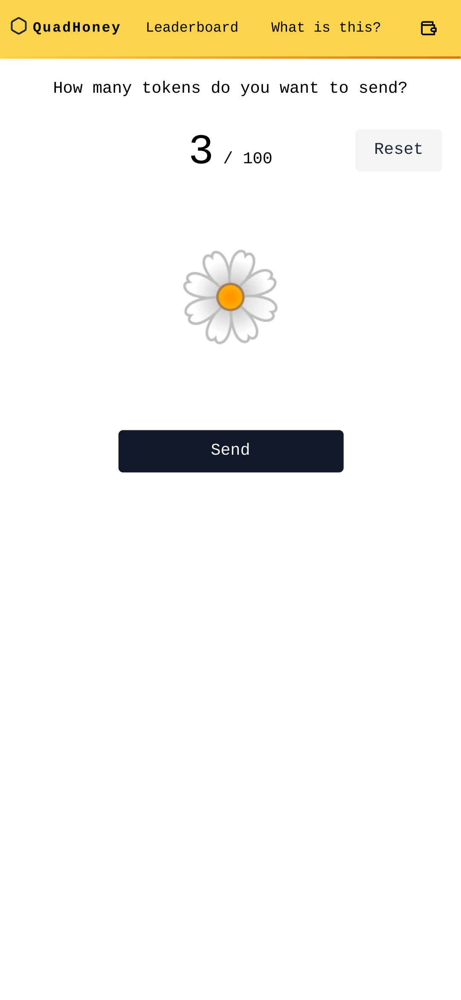
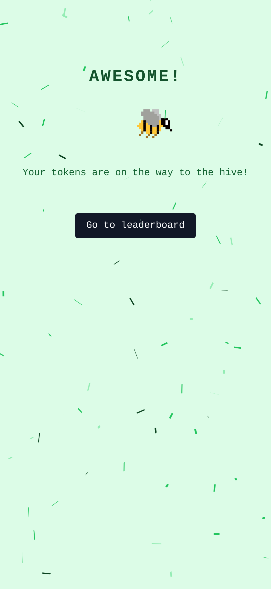
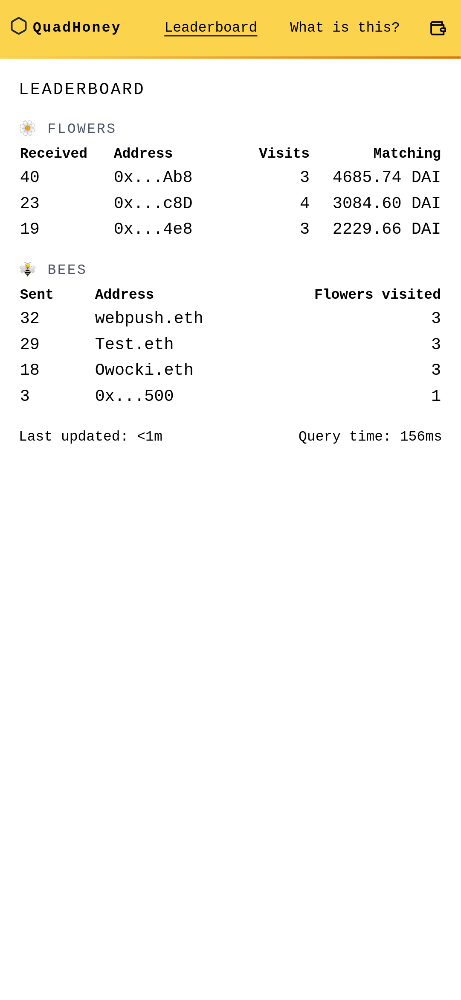

# QF Flash

QF Flash or Quadratic Honey is an experiment with burner wallets and Quadratic Funding. Built before ETH Denver 2023

https://www.youtube.com/watch?v=7xUtXOh_sJE

https://community.supermodular.xyz/t/qf-flash-game/245/3

> ### A QF Flash Game that takes place at a live event, powered by burner wallets.
>
> 1. Users who attend an event receive a burner wallet pre-loaded with 100 QF tokens. One person per wallet.
> 2. Users are instructed to send tokens to whomever they think is a legit builder during the event. Through the event, users can send QF tokens to one another by using the burner wallet send functionality.
> 3. At the end of the event, a QF round of 2,000 DAI is paid out. Each QF transaction gets matched quadratically by the DAI.
>
> This QF Flash Game could be used in the following scenarios:
>
> 1. To measure the organic legitimacy of conference participants.
> 2. As a fun/easy way to dropping tokens on conference attendees.
> 3. In a “demo day” or “demo booth” kind of environment, it could be used as way of measuring which demos are most legit.
> 4. As a way of speedrunning collusion attacks to see how they organically develop across conference participants

    
    
    
    

